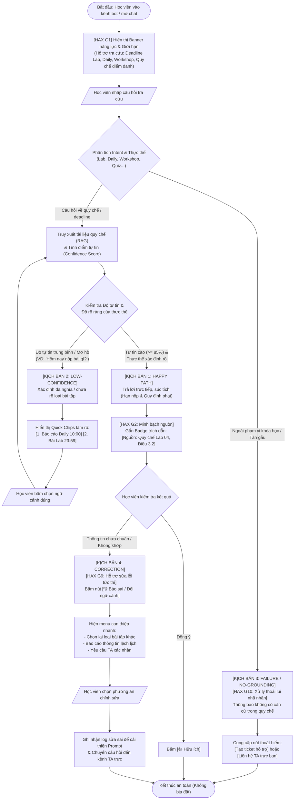

# Sơ đồ Luồng Chi tiết (Interactive AI Flowchart) — CP2
**Dự án:** Trợ lý Quy chế & Deadline Học viên (Track B - Discord Assistant)  
**Nhóm:** K4-3A-XYZabc · **Mức Prototype:** Mock (Bản mẫu tương tác mô phỏng)

---

## 1. Sơ đồ Luồng Nghiệp vụ Toàn diện (Mermaid Flowchart)

---

## 2. Diễn giải 4 Kịch bản Trải nghiệm (4 Paths)

### Kịch bản 1: Happy Path (Độ tự tin cao)
* **Tình huống:** Học viên hỏi cụ thể: *"Hạn nộp bài Lab 02 là khi nào?"*
* **Điểm quyết định AI:** Phân loại đúng thực thể `Lab 02`, intent `deadline`. Điểm tự tin tài liệu đạt $0.95$.
* **Phản hồi:** Trả lời trực tiếp giờ và ngày, kèm trích dẫn văn bản quy chế chính thức (`[Quy chế Lab 02, Ban hành 15/9]`).
* **Kết thúc:** Học viên nhận thông tin chuẩn xác, không bị nhầm lẫn với Daily Standup.

### Kịch bản 2: Low-Confidence Path (Độ tự tin thấp / Mơ hồ)
* **Tình huống:** Học viên hỏi: *"Hôm nay mấy giờ phải nộp bài?"*
* **Điểm quyết định AI:** Trong ngày có 2 mốc hạn: Daily Standup (10:00) và Bài Lab 02 (23:59). AI không được tự ý phán đoán một loại.
* **Phản hồi:** Đưa ra các nút chọn nhanh (Quick Suggestion Chips):
  * `[1] Báo cáo Daily Standup`
  * `[2] Bài tập Lab 02`
* **Kết thúc:** Học viên bấm chọn, bot trả lời đúng hạn của loại bài đó.

### Kịch bản 3: Failure / No-Grounding Path (Không tìm thấy căn cứ / Ngoài phạm vi)
* **Tình huống:** Học viên hỏi: *"Thầy giáo thích ăn gì?"* hoặc một quy định chưa từng được ban hành trong tài liệu.
* **Điểm quyết định AI:** Độ tương đồng ngữ nghĩa trong Vector DB thấp ($< 0.4$).
* **Phản hồi:** Tránh bịa đặt (Hallucination). Nêu rõ: *"Hệ thống không tìm thấy quy định này trong tài liệu chính thức của khóa học."*
* **Lối thoát hiểm:** Đính kèm nút `[Tạo ticket hỏi TA / Mod]` để học viên không bị bế tắc.

### Kịch bản 4: Correction Path (Cơ chế người dùng sửa lỗi / can thiệp)
* **Tình huống:** Học viên thấy bot trả lời chưa đúng hoặc nghi ngờ tài liệu cũ.
* **Điểm can thiệp:** Dưới mỗi phản hồi luôn có cặp nút `[👍]` và `[👎 Báo sai]`.
* **Phản hồi:** Khi bấm `[👎]`, hệ thống mở panel chỉnh sửa: cho phép học viên đổi loại bài tập, hoặc gửi cảnh báo đến TA để dập lửa ngay lập tức.

---

## 3. Bản đồ 4 Nguyên tắc Thiết kế AI (HAX / PAIR) trên Luồng

| Nguyên tắc | Bộ tài liệu | Vị trí áp dụng cụ thể trên giao diện | Mục đích ngăn ngừa rủi ro |
|---|---|---|---|
| **HAX G1** (Make clear what system can do) | Microsoft HAX | Banner chào mừng ở đầu kênh + Gợi ý câu mẫu | Ngăn học viên hỏi các câu lan man, thiết lập đúng kỳ vọng |
| **HAX G2** (Make clear how well system can do) | Microsoft HAX | Badge nguồn trích dẫn `[Nguồn: ...]` kèm nhãn độ xác thực | Giúp học viên tự kiểm chứng, nhận thức đây là hệ thống hỗ trợ (Augment) |
| **HAX G9** (Support efficient correction) | Microsoft HAX / PAIR | Nút `[👎 Báo sai]` và bảng chọn lại ngữ cảnh 1-click | Giúp người dùng sửa sai ngay khi AI nhầm lẫn |
| **HAX G10** (Scope of services / Graceful failure) | Microsoft HAX / PAIR | Hộp thông báo "Không tìm thấy căn cứ" + Nút `[Hỏi TA]` | Tuyệt đối không bịa đặt deadline, đảm bảo an toàn điểm số |

